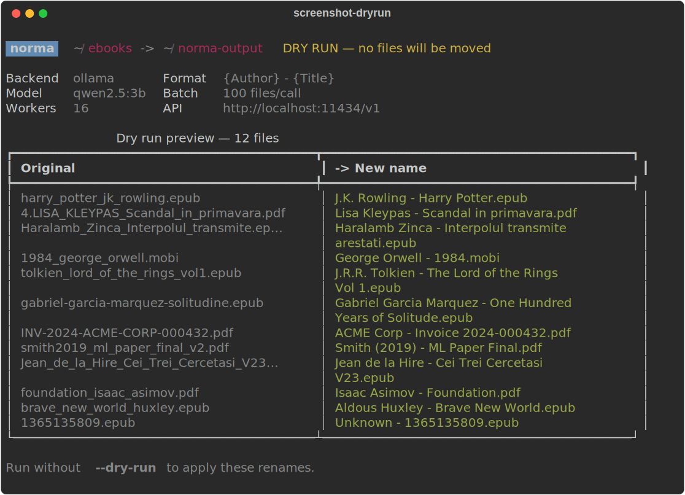
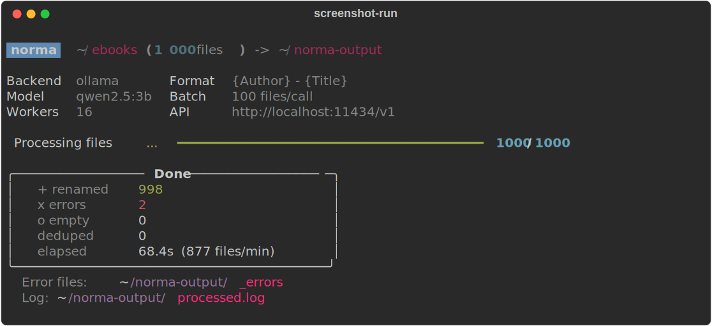
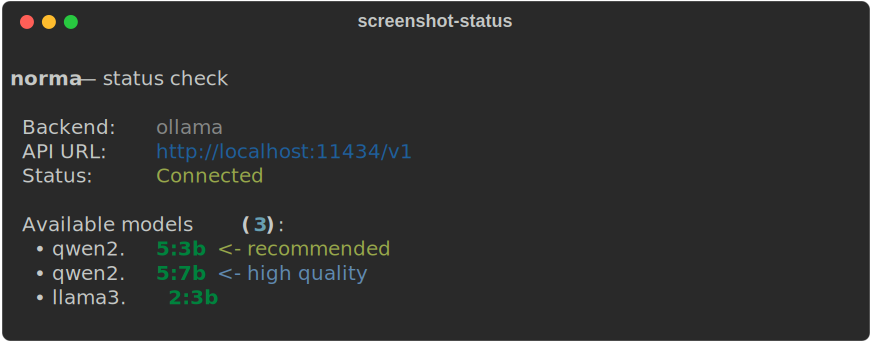

<div align="center">

<h1>norma</h1>

<p>
  <strong>AI-powered file renamer — any format, any language, entirely local.</strong><br/>
  Feed it a folder of messy filenames. Tell it what you want. Done.
</p>

<p>
  <a href="https://www.python.org/downloads/"></a>
  <a href="https://ollama.com"></a>
  
  <a href="LICENCE"></a>
</p>



<p><a href="README.ro.md">🇷🇴 Română</a></p>

</div>

---

## What it does

norma sends batches of filenames to a local LLM and renames them to whatever format you define — regardless of input language, naming convention, or domain.

```text
harry_potter_jk_rowling.epub            →  J.K. Rowling - Harry Potter.epub
4.LISA_KLEYPAS_Scandal_in_primavara.pdf →  Lisa Kleypas - Scandal in primavara.pdf
Haralamb_Zinca_Interpolul_transmite     →  Haralamb Zincă - Interpolul transmite arestaţi.epub
1365135809.epub                         →  Unknown - 1365135809.epub
INV-2024-ACME-CORP-000432.pdf           →  ACME Corp / Invoice / 2024-000432.pdf
smith2019_ml_paper_final_v2.pdf         →  Smith (2019) - ML Paper Final.pdf
```

The format is entirely up to you. norma adapts to any `{Field}` template you give it.

> **Privacy-first:** every filename stays on your machine. No data is sent to any external service.

---

## Features

- **Universal format** — define any output template with `{Field}` tokens: `{Author} - {Title}`, `{Client} / Invoice / {Date}`, `{Artist} - {Album} ({Year})`, anything
- **Any language** — handles English, Romanian, Spanish, Japanese, mixed scripts; preserves diacritics
- **Batched inference** — sends 100 filenames per LLM call instead of one; ~10× faster than naive approaches
- **Concurrent workers** — 16 threads submit batches in parallel, saturating the GPU queue
- **Auto-retry** — failed files are automatically retried up to 3 times before being moved to `_errors/`
- **Dry-run mode** — preview every rename in a table before touching a single file
- **Two backends** — works with [Ollama](https://ollama.com) or [LM Studio](https://lmstudio.ai)
- **Collision-safe** — duplicate output names get `(2)`, `(3)` suffixes automatically
- **Large libraries** — auto-splits folders >3000 files into named subfolders before processing

---

## Requirements

- Python 3.10+
- [Ollama](https://ollama.com) **or** [LM Studio](https://lmstudio.ai) running locally

**Recommended model (Ollama):**

```bash
ollama pull qwen2.5:3b
```

**LM Studio:** load `qwen2.5-3b-instruct` in the Developer tab and start the local server.

---

## Install

```bash
# Isolated install (recommended)
pipx install .

# Development install
pip install -e .
```

---

## Usage

### Preview renames before applying

```bash
norma run ./my-ebooks --format "{Author} - {Title}" --dry-run
```


### Rename a folder

```bash
norma run ./my-ebooks --format "{Author} - {Title}"
```



### Check backend connectivity

```bash
norma status
norma status --backend lmstudio
```



---

## More format examples

```bash
# Invoices
norma run ./invoices --format "{Client} / Invoice / {Date}"

# Research papers
norma run ./papers --format "{Author} ({Year}) - {Title}"

# Music albums
norma run ./albums --format "{Artist} - {Album} ({Year})"

# Legal documents
norma run ./contracts --format "{Company} - {Type} - {Date}"

# Rename to a different folder
norma run ./source --format "{Author} - {Title}" --output ./renamed
```

norma infers what each `{Field}` means from its name. You do not need to configure field definitions.

---

## LM Studio backend

```bash
# Check LM Studio connectivity
norma status --backend lmstudio

# Run with LM Studio
norma run ./books --format "{Author} - {Title}" --backend lmstudio
```

LM Studio ignores the `--model` flag — it uses whichever model is currently loaded in the Developer tab.

---

## All options

```text
norma run <folder> [options]

  --format    -f   Output naming template          default: "{Author} - {Title}"
  --output    -o   Destination folder              default: <input>/../norma-output
  --model     -m   Model name                      default: qwen2.5:3b
  --workers   -w   Concurrent worker threads       default: 16
  --batch-size -b  Files per LLM call              default: 100
  --dry-run   -n   Preview renames, copy nothing   default: false
  --backend        ollama or lmstudio              default: ollama
  --api-url        Override API base URL
  --max-retries -r Retry failed files N times      default: 3
```

---

## Performance

norma achieves high throughput by batching filenames (100 per call) and submitting batches concurrently. This amortises the system-prompt cost across many files and keeps the GPU pipeline saturated.

| Config | Throughput |
| ------ | ---------- |
| `qwen2.5:3b`, batch 100, 16 workers | **~870 files/min** |
| `qwen2.5:3b`, batch 15, 8 workers (old default) | ~590 files/min |
| `qwen2.5:7b`, batch 100, 16 workers | ~300–450 files/min |

Tested against 1 000 diverse files (multilingual, messy, numeric, research-paper-style). Results vary by hardware.

> The 10-iteration autoresearch benchmark that produced these numbers is in [`benchmark/`](benchmark/).

---

## Output structure

```text
norma-output/
├── J.K. Rowling - Harry Potter.epub
├── Lisa Kleypas - Scandal in primavara.pdf
├── Isaac Asimov - Foundation.pdf
├── ...
├── _errors/          ← files norma could not rename after all retries
├── processed.log     ← tab-separated record of every rename
└── norma.log         ← detailed run log
```

Files that could not be renamed (e.g. pure numeric IDs with no context) land in `_errors/`. Re-run them with a different model or format:

```bash
norma retry ./norma-output/_errors --format "{Author} - {Title}" --model qwen2.5:7b
```

---

## How it works

```text
CLI (cli.py)
  └─ builds Config dataclass
  └─ calls run_pipeline()

pipeline.py
  └─ auto-splits folders > 3 000 files
  └─ collects all files
  └─ chunks into batches of 100
  └─ submits to ThreadPoolExecutor (16 workers)
        │
        ▼
processor.py (per batch)
  └─ sends numbered list of stems to LLM
  └─ parses numbered response
  └─ falls back to per-file calls on count mismatch
  └─ validates output matches format (contains separator)
  └─ copies file to output folder, handles collisions

dedup.py
  └─ removes source files already in output (by filename match)
```

All configuration flows through a single `Config` dataclass — no global state, no hardcoded paths.

---

## License

[MIT](LICENCE)
